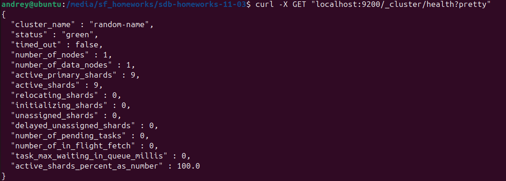
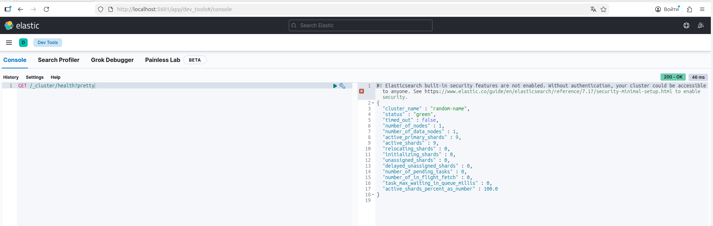
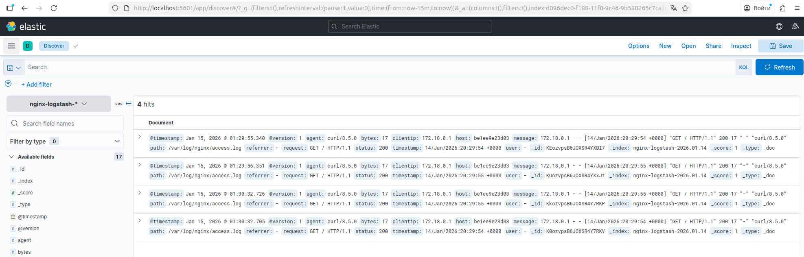
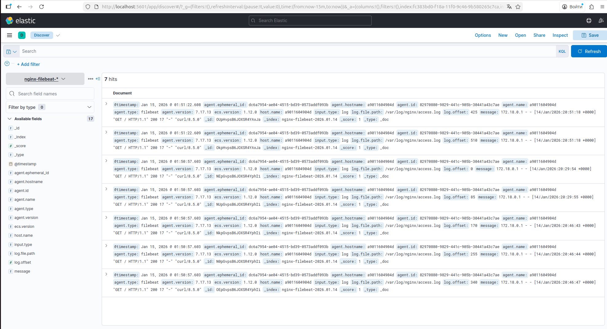

# Домашнее задание к занятию "`ELK`" - `Сунцов Андрей`

---

### Задание 1

`Установите и запустите Elasticsearch, после чего поменяйте параметр cluster_name на случайный.`

---

### Задание 2

`Установите и запустите Kibana.`

---

### Задание 3

`Установите и запустите Logstash и Nginx. С помощью Logstash отправьте access-лог Nginx в Elasticsearch.`

### Задание 4

`Установите и запустите Filebeat. Переключите поставку логов Nginx с Logstash на Filebeat.`

