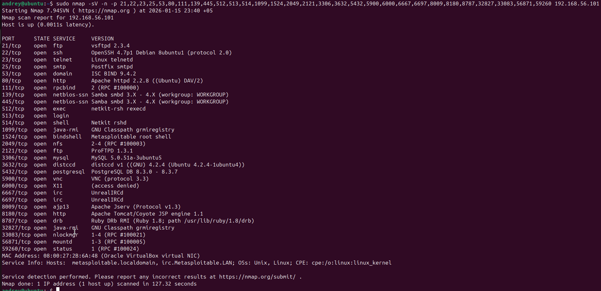

# Домашнее задание к занятию "`Уязвимости и атаки на информационные системы`" - `Сунцов Андрей`

---

### Задание 1

1. `Какие сетевые службы в ней разрешены?`

2. `Какие уязвимости были вами обнаружены? (список со ссылками: достаточно трёх уязвимостей)`

   - `vsftpd 2.3.4` - https://www.exploit-db.com/exploits/17491
   - `UnrealIRCd` - https://www.exploit-db.com/exploits/16922
   - `distccd` - https://www.exploit-db.com/exploits/9915

---

### Задание 2

1. `Чем отличаются эти режимы сканирования с точки зрения сетевого трафика?`

`Они отличаются тем, как отправляются пакеты и анализируются ответы`

2. `Как отвечает сервер?`

- `SYN: Если TCP-порт открыт, хост должен отправить ответ SYN/ACK. Если порт закрыт - должен отправить ответ RST.`
- `FIN и XMAS: Если порт закрыт, хост должен отправить ответ RST. Если порт открыт - должен проигнорировать.`
- `UDP: Если порт закрыт, хост должен отправить ответ ICMP. Если порт открыт - либо UDP либо ответа нет.`

[Записанные сеансы сканирования в Wireshark](sdb-homework-13-01.pcapng)